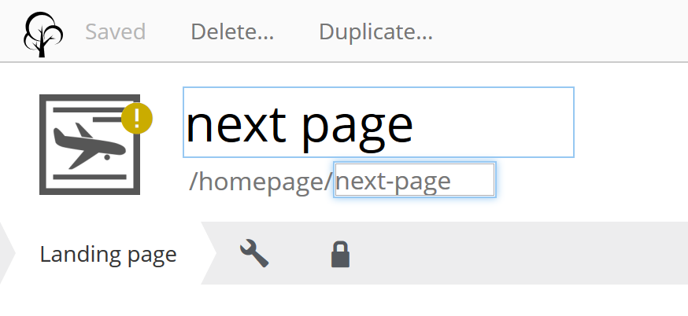
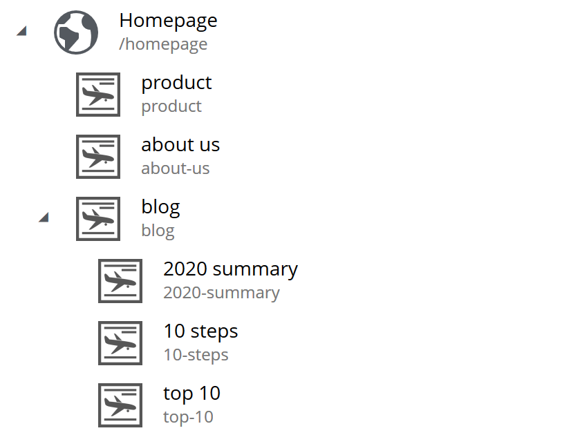

= XP developers guide to SEO

SEO has become a hot topic, and we developers can make it easier for everyone if we use it properly. This guide will show you how to create seo improvements.

[quote, The Google search quality team]
____
Search Engine Optimization is about helping search engines understand and present content.
____

== Introduction
SEO: Helping search engines find what they need to produce search results. We can develop to make it easier for search engines to find information about the site.

Overusing SEO can result in lower page rankings. Too much of a good thing.

Its recommended to have worked with Enonic XP and link:https://market.enonic.com/vendors/enonic/content-studio[Content Studio] for the guide.

[#sitemap]
== Sitemap

If you want to help search engine crawlers locate pages or other files on your site, you can create a sitemap. 
Sitemap is a file that located on `{domain}/sitemap` this lists all pages that you want the search engines to search.

Sitemap files can be in different formats, an RSS feed, text file or XML.
The most accurate one is the XML format as it gives additional information. A single sitemap file has a limit of 50,000 urls.

.sitemap.xml
[source, xml]
----
<?xml version="1.0" encoding="UTF-8"?> 
<urlset xmlns="http://www.sitemaps.org/schemas/sitemap/0.9">
    <url>
        <loc>http://example.com<loc>
       <lastmod>2020-27-04</lastmod>
       <changefreq>daily</changefreq>
       <priority>0.8</priority>
    </url>
</urlset>
----

.Sitemap tags
|===
|XML tag |Necessity |Description
|<urlset>
|required 
|Groups all the entries, and links to the standard
|<url>
|required
|Main tag of each entry
|<loc>
|required 
|Link to the page. With protocol, (http, https). Max length: 2,048 characters
|<lastmod> 
|optional
|A datetime in W3C format. Eg. YYYY-MM-DD
|<changefreq>
|optional
|How often the page changes. +
Valid values are: + 
always, hourly, daily, weekly, monthly, yearly, never
|<priority>
|optional
|Priority of the url relative to other urls. 
Values range from 0.0 - 1.0
|===

See link:https://www.sitemaps.org/protocol.html[Sitemap protocol] for details.

Put the sitemap on the root directory of the page `{domain}/sitemap.xml`.  
It can be located on any path, but this limits the sitemap to only pages located under it. 
`\https://example.com/test/sitemap.xml` can not link to `\https://example.com/foobar`. 
You don’t always need a sitemap.xml file for your site. 
If you have a small site or all of your pages have good linking between them then it could be that it is not needed. 

NOTE: Enonic XP has an app that handles the sitemap for you. The app is named link:https://market.enonic.com/vendors/enonic/com.enonic.app.sitemapxml[sitemap.xml] and can be installed from our market, it’s available on any installation. Be aware, this app is not suited for very large sites. 

[#sitemap-index]
=== Sitemap index 
Sometimes you want to use multiple sitemap files for a site like when reaching the *limit of 50.000 entries*.  
To use multiple sitemaps add a sitemap index file. 

.sitemap index
[source, xml]
----
<?xml version=”1.0” encoding=”UTF-8”?>
<sitemapindex xmls=”http://www.sitemaps.org/schema/sitemap/0.9”>
  <sitemap>
    <loc>https://foobar.org/sitemap1.xml</loc>
    <lastmod>2020-01-01</lastmod>
  </sitemap>
  <sitemap>
    <loc>https://foobar.org/sitemap2.xml</loc>
    <lastmod>2005-01-01</lastmod>
  </sitemap>
</sitemapindex>
----

.sitemapindex tags
|===
|Attribute |Require |Description
|<sitemapindex>
|Yes
|Parent tag for the sitemapindex file
|<sitemap>
|Yes
|Parent tag for single sitemap
|<loc>
|Yes
|Url to the sitemap
|<lastmod>
|No
|Last time the sitemap was changed
|===

Sitemap index file gives information on where the other sitemap files are located.  
The siteindex file name is same as the sitemap. `{domain}/sitemap.xml`

Additiona details read:
link:https://support.google.com/webmasters/answer/156184[Google sitemaps],
link:https://support.google.com/webmasters/answer/75712[Goole sitemap index]

[#image-sitemap]
=== Image sitemap
If you want to give information to the crawler about images google has an option for this. 
Can both be a separate sitemap or add to the existing one.

.sitemapindex example
[source, xml]
----
<?xml version="1.0" encoding="UTF-8"?>
<urlset xmlns="http://www.sitemaps.org/schemas/sitemap/0.9"
  xmlns:image="http://www.google.com/schemas/sitemap-image/1.1">
  <url>
    <loc>http://example.com/sample.html</loc>
    <image:image>
      <image:loc>http://example.com/image.jpg</image:loc>
    </image:image>
    <image:image>
      <image:loc>http://example.com/photo.jpg</image:loc>
    </image:image>
  </url>
</urlset>
----

.Extended standard sitemap xml:
|===
|Tag |Require |Description
|<image:image>
|Yes
|Grouping parent tag. Limit: 1,000 image for each <url>
|<image:loc>
|Yes
|Image url
|<image:caption>
|No
|Image description
|<image:geo_location>
|No
|Location data. City, County, etc
|<image:title>
|No
|The title of the image
|<image:license>
|No
|Url to image license
|===

Sitemaps need to be submitted to search engines, each search engine has a interface to submit them 
Or you can open this url: {searchengine_url}/ping?sitemap={sitemap_url}  
Example: bing.com/ping?sitemap=https://foobar.com

**Useful links:** +
The link:https://www.sitemaps.org/protocol.html[Sitemaps protocol], read more about link:https://support.google.com/webmasters/answer/178636[googles image sitemap]

[#Robots]
== Robots.txt
While a sitemap will inform what pages should be crawled, the Robots.txt file tells the crawler what should not be crawled. 
If you don’t want a page crawled simply disallow that page in the robots.txt file. 
Examples of pages that should be excluded: search pages, empty pages, test pages, error pages. 
You probably do not want a user to get redirected from a search engine to a search on your own site. 
Robots.txt format:

.robots.txt example
[source, txt]
----
  User-agent: *
  Disallow: /search/
  Disallow: /test/
  Disallow: /tmp/
----

User-agent::
What robots are allowed to crawl the site. Wildcard "*" for any.
Dissallow::
What area not to be crawled.

`Disallow: /search/` will exclude:

* `{siteurl}/search.html` 
* `{siteurl}/search/` 
* `{siteurl}/search/foo.html`

Some search engines have extended the format to allow new features in the robots.txt format. Like wildcards in the Disallow value.

NOTE: The app link:https://market.enonic.com/vendors/enonic/com.enonic.app.robotstxt[Robots.txt] gives the option to add your own robots.txt file 

Also read link:https://support.google.com/webmasters/answer/6062608[google robots.txt] for more details.

[#meta-exclude]
=== Meta exclude

While it is possible to exclude a single page in robots.txt file, it will not stop the page from appearing in search engine results. 
This is because a link to a page can be indexed without the crawler visiting it. 

Let’s say on site: \http://foobar.com there is a link to a login page. Crawlers could find the login link and show the link on the search engine even when robots.txt file excludes the target page. 
Adding a exclude meta tag to the page will tell crawlers to not index the page. This stops the site from appearing in results.

[source, html]
----
<meta name="robots" content="noindex" />
----

Meta tags need to be in the `<head>` section of a page. 

Creating the meta tag is included in the link:https://market.enonic.com/vendors/enonic/com.enonic.app.metafields[SEO metafield app]. 
It will include a checkbox in the bottom of the content with “Hide from external search engines?”. 
Checking this will include the meta tag. 

NOTE: If you want to read more about exclusion see the indetail article link:https://developers.google.com/search/reference/robots_meta_tag[Robots meta tag]

== Tags and attributes

Sometimes search engines will link to a page in the wrong language. 
Other times they will guess at the headline or name of a page.  
Including the correct tags gives crawlers information to index the pages correctly.

[#title]
=== Title tag

For any user visiting your site, you want an accurate and descriptive title that will help them find the page they are looking for.  
This is also true for crawlers. Similar or identical titles can confuse or make it difficult to tell different pages apart.  
Each page should have a unique title. 

In XP use the content *display name* to set a title. 
The template engine Thymeleaf is used in the example below:

.JS controller
[source, JavaScript]
----
const thymeleaf = require(“/lib/thymeleaf”);
const portal = require(“/lib/xp/portal”);

const view = resolve(“myViewFile.html”);
 
exports.get = function() {
  let content = portal.getContent();
  let model = {
    title : content.displayName;
  }
  return {
    body: thymeleaf.render(view, model),
  }
}
----

.Viewfile thymeleaf
[source, html thymleaf]
----
<html>
    <head>
        <title data-th-text=”${ title }”></title>
        [...]
    </head>
    [...]
</html>
----

If you don’t want your own code to set a title, our link:https://market.enonic.com/vendors/enonic/com.enonic.app.metafields[SEO metafield app] on the Enonic market has an override title feature. 
There you can set your own title that will replace any previously set title on the page.

[#languages]
=== Languages

Search engines will tailor the result to specific languages. 
There are a lot of factors that give crawlers information on what language the site is in. 
The first thing most crawlers look for are meta tags and the lang attribute.

Adding a meta tag to your html document:

[source, html]
----
    <meta http-equiv="content-language" content="en-us">
----

The http-equiv created simulates response header data. So you can set content-language in the response.

Another option is setting the lang attribute on the `<html>` tag. The attribute sets the language for everything inside it, on a `<html>` tag it sets the language for the entire page. 

.Controller
[source, JavaScript]
----
const portal = require(“lib/xp/portal”);
exports.get = function() {
    let content = portal.getContent();
    let model = {
        language = content.language,
    }
    return {
        body: thymeleaf.render(view, model),
    };
}
----

.View file
[source, html]
----
<html data-th-attr=”lang=${content.language}”>
    [all other dom elements]
</html>
----

The attributes should be in format: link:https://en.wikipedia.org/wiki/List_of_ISO_639-1_codes[ISO_639-1] and optionaly a dash “-” and link:https://no.wikipedia.org/wiki/ISO_3166-1[ISO_3166-1]. 
Simply (language code) - (region code). 

It might not always be necessary to add a region code. 
A site in English (en) might not need the region code (us, uk) unless your site supports that language variant. 

How to set the correct content-language header in a controller:

[source, JavaScript]
----
const portal = require(“lib/xp/portal”);

exports.get = function() {
    let content = portal.getContent();
    return {
        body: “Your html or dynamic rendering here”,
        header: {
            “content-language”: “nb-no”
        }
    };
}
----

You have to set the language in Content Studio or handle that the value can be undefined.

NOTE: Our link:https://market.enonic.com/vendors/enonic/com.enonic.app.metafields[SEO meta fields] app sets the content language on the html tag, so that you don’t have to add it in your own application. 
It simply adds it based on what content language you set in content studio. 

Addition link: link:https://blogs.bing.com/webmaster/2011/03/01/how-to-tell-bing-your-websites-country-and-language/[Bing on site language] or link:https://developers.google.com/web/tools/lighthouse/audits/hreflang[google on lang tag] 

=== Multilingual sites

Some sites will have different language variants. 
If you don’t give the correct information to crawlers, they can index your page multiple times.
Users could find the wrong language in search results, and can give a negative experience.

It is recommended to have different URLs for different languages of the site. This is because it can be difficult for crawlers to find different versions of a page if they are changed with JavaScript or IP address lookup. Bing and Google both use crawlers located in the USA, so they might not find the correct pages if you change the site content depending on the ip or location.

Adding a `<link>` with hreflang and href to the site in the `<head>` metadata will link to languages of the different sites. 
Crawlers can then index the different pages and give users the best language for the search they made.
[source, html]
----
  <link rel="alternate" hreflang="nb-no" href="no.example.com/" />
----

The hreflang value should be link:https://en.wikipedia.org/wiki/List_of_ISO_639-1_codes[ISO_639-1] language code followed by (optional) a dash “-” and link:https://no.wikipedia.org/wiki/ISO_3166-1[ISO_3166-1] region code. 
The language code ISO_639 is required. Example: "en-gb" or just "en" english language code, and "gb" Great Britain country code

Each page needs to have a `<link>` to its own lanuage and to the other languages. 
If you have an English, Norwegian and Belarusian page, all 3 pages need to have three `<links>` to the other language pages.  
The link should be close to the top of the head tag and needs to be in the `<head>` element for crawlers to find it.

It is also recommended (not required) to have an option for matching any language. This is done with “hreflang="x-default"”. This can link to a page where the user can select the language or link to the language most used most ofen english. 

You can add the different pages to each language to a sitemap.xml. 
You need to specify the namespace of the xml file: xmlns:xhtml="http://www.w3.org/1999/xhtml"

.sitemap language example
[source, xml]
----
<?xml version="1.0" encoding="UTF-8"?>
<urlset xmlns="http://www.sitemaps.org/schemas/sitemap/0.9"
  xmlns:xhtml="http://www.w3.org/1999/xhtml">
  <url>
    <loc>https://no.foobar.com/page.html</loc>
    <xhtml:link rel="alternate" hreflang="nb" href="https://no.foobar.com/page.html" />
  </urlset>
</urlset>
----

Same as with `<link>` each page needs to refer to all other pages including itself. 
Each <url> tag needs a <xhtml:link> to its own page, and the other language pages.  
If the pages did not link back, anyone could add a page to a sitemap and claim to be part of a site. 
If you have different pages for each language use a sitemap index and add a sitemap to each of the translated pages. 

link:https://support.google.com/webmasters/answer/182192[google multilanguage sites]

=== Open Graph

When you share a page on a message app or post it online a page preview or thumbnail can shows up, maybe even the title and description of that page.  
This is often used by social media and is called rich media. 
Open graph is the protocal used to make websited rich media objects. 
Having a presence in social media helps your ranking on search engines.  
Search engines want to find relevant content for users, and this is made simpler if they are matched to interested groups. 
Open Graph data can be used for a lot more than just sharing messages on social media. 

There are some required meta tags for the Open Graph protocol:

[source, html]
----
<meta property="og:title" content="top 10 frameworks" />
<meta property="og:type" content="article" />
<meta property="og:image" content="http://ia.media-imdb.com/images/rock.jpg" />
<meta property="og:url" content="http://www.imdb.com/title/tt0117500/" />
----

*og:title*: Should be the title of the content, often the headline or name. +
*og:type*: The type of content on the page. Values: article, book, profile, music.song, music.album, music.playlist, music.radio_station, video.movie, video.episode, video.tv_show, video.other, website. All types https://ogp.me/#types +
*og:image*: A URL to a representative image for the content of the page. +
*og:url*:     A canonical URL for your content. An identifier to the content of the page. +
E.g. when the website's content is a movie. Then the URL links to the movies entry on a movie archive website. +

There are some optional tags. It is recommended to include them. +
*og:audio*: The URL to the content audio +
*og:description*: A short description of what is on the page. +
*og:determiner*: The word that appears before the name of the content in a sentence. A, An, The, “” (blank) or Auto. Auto will give the choice of a or an. +
*og:local*: The locale of the tags. What language they are in. Format: , an link:https://en.wikipedia.org/wiki/List_of_ISO_639-1_codes[ISO_639-1] underscore “_” and link:https://no.wikipedia.org/wiki/ISO_3166-1[ISO_3166-1]. +
*og:locale*:alternate: Other locales this page is available in. +
*og:site_name*: The site name the object is part of. This is often the homepage title or company the page belongs to. +
*og:video*: A url video that compliments this page. +

NOTE: link:https://market.enonic.com/vendors/enonic/com.enonic.app.metafields[SEO Meta Fields] app handles  Open Graph properties for different social media platforms.
The app tries to search for the different properties in the content data, but you can set values in the SEO content field.

For more details see the link:https://ogp.me/[Open graph protocol]

== URLs
Properly understanding and creating URLs can help both search engines and people visiting the site. 

The structure of an url: `{protocol}://{host}/{path}?{query}#{fragment}`

Protocol:: Search engines prefer the use of https over http.  Different protocols are handled by crawlers, so http and https are seen as different sites. 
Use redirects so crawlers and users get the same protocol. Eg. http redirects to the https version. 
Host:: Should be the main name of your organization or product. 
Even with users being able to bookmark different pages, avoid having really long names. 
It should be possible to remember the site name and navigate to it.  Search engines see different pages with www and without www.  
Set up redirects so that all pages resolve to the same host. Eg. www.example.com resolves to example.com. 
Path:: The path adds a more specific destination on the page. 
This is case sensitive so the example.com/blog is not the same as example.com/Blog. 
The same goes for trailing slashes. example.com/blog is not the same page as example.com/blog/.
Query/fragment:: Bing recommends to avoid using these if possible. Google will ignore fragments. 

Content Studio has a built in way to handle URLs. When generating URLs, it will never create trailing slashes.  
Going to a page with the trailing slashes will always result in the same page as without the trailing slash. 

Handling the query part of the URLs is simple inside the page controller. 
All query variables will be returned in the request object parameters. 

.Example controller
[source, JavaScript]
----
// Triggered url: www.foobar.com?test=true&s=blog /

exports.get = function(request) { 
    let test = request.params.test;
    let search = request.params.blog;
    log.info(test);
    log.info(search);
}
----

=== Human readable urls
It is easier to remember a simple URL that does not contain lots of numbers or not understandable text.

**bad:**  example.com/folder5/b5c145d1-353c-43c5-85fb-35d02cbf7d89.html +
**good:** example.com/articles/top-ten-games-2020.html +

Setting simple and understandable URLs will make it clear where in the site hierarchy you are.
Enonic XP creates URLs for a page with its **name**, in content studio.

.content studio name and path field

In the above image: “next page” is the displayName, “next-page” is the name

== Site structure 
When a crawler goes through a site structure, it will follow links found on the domain.
Lets say that in the menu is a link to /blog. The crawler will follow this link and it knows then that the homepage (foobar.com) goes to the blog page. 
By going through all the links like in this it will map the site structure, and it will also know the main pages or the most important pages. 

So having a site higher up in the hierarchy give information to search engines that the pages are more important. 

Example structure: 

Having the blog page straight under the main site marks it as a more important site than one of the blog articles. The URL to the blog in the example above would be homepage/blog

When using Content Studio, each page will automatically create the page where you placed it in the site structure. 
Creating the page blog under homepage will result in the URL: www.homepage.no/blog.  
This is important to keep in mind so you do not create unnecessary site structure.

=== Breadcrumbs
It can also be helpful to add breadcrumbs on all pages to give a better understanding to both crawlers and people on where on the site they currently are. 
Since crawlers follow links having short navigational links from where the page was and where you currently are, can give some help to the crawler how the page is structured.

Example:
URL: www.home.com/blog/top-10
Breadcrumb: home-> blog -> top 10
Where each breadcrumbs word is a link to that page. 
“Home” goes to www.home.it 
“Blog” goes to www.home.it/blog
“Top 10” goes to www.home.it/blog/top-10

== Error pages
When following links or by changing the url a user can find a page that does not exist. 
Handling this can have an impact on the user experience and the website. 
If the users sees an error message or technical data on visiting a page this will often confuse them and they can simply leave because of it.

It is recommended to create error pages that allow the user to go back or continue the navigation of the site. 
Its recommended to make suggestions to other pages or take them back to the homepage. 
Even crawlers can benefit from this, since the crawlers map internal links on the site, they can also find pages that don’t exist anymore.

Creating error pages can be difficult, since you have to handle all pages that do not exist. 
Enonic XP gives a simple solution to handle error pages by using an error controller.  
The error controller can handle all http status codes, like 404 status code (not found). 

To create an error handler:

1. Add a folder in your project `src\main\resources\site\error` 
2. Add error.js in the folder, you can also add a view file. 

.Example error handler:
[source, JavaScript]
----
exports.handleError = function(req) {
    // Handle possible request

    return {
      body: "Could not find the page",
    }
}
----

NOTE: Be careful not to trigger an error in the error controller. This will result in a loop of the error controller trying to handle its own error.  

Read about link:https://support.google.com/webmasters/answer/93641[google error page] for google specific details.

== Redirects
Redirect are pages that send the traffic from one page to another. 
This is often done when migrating a page, the page switches domain or when multiple urls go to the same page. 

There mainly two main HTTP status codes used for redirects: +
*302 found* +
*301 permanently moved* +

If a page is temporarily moved use HTTP status code 302. 
It will tell anyone visiting the site that the URL is temporarily moved to another page. 
A crawler will index your page on the given URL and not the resolved URL after a redirect. 
 
The other side of this would be a 301 or a permanently moved page then a crawler will index the resolved URL (target page) instead of the requested URL. 

Example: +
www.foobar.com/test redirects to www.foobar.com/demo +
With a *302 code*, the /test page gets indexed. +
With a *301 code*, the /demo page gets indexed. +

//Redirect app (soon™)

== Quality
There are some things that you can do to improve the quality of your page that will also improve the ranking on search engines. 
One of the things that help improve a web page is letting non-graphical users understand the page. 
A crawler does not see whats on an image, it does not have eyes. Improving accessibility will improve the quality of a site for users and SEO.

*Alt attribute*

A simple addition to all images is a description of the image in its alt attribute. 
This will give information about the image to those who don’t see the graphic image, like screen readers or crawlers.  
A description should be as short and precise as possible. 
Another benefit of adding alt attributes is that if the image can’t be rendered, the alt text will be displayed instead.

Image tag with alt attribute:

.image tag example
[source, html]
----

----

=== Page speed
The most difficult metric in SEO is probably page speed. 
Page speed is often talked about when it comes to SEO and website development in general. 
I hope to shed some light on the subject and how page speed is linked to SEO. 

Fast page speeds is plays a roll in ranking on search engines, but it is one of many metrics used in calculating search engine ranking. 
Having a page that uses a lot of time before the main content is shown will not be good for the user or crawlers. 
A page needs to follow the user behavior. Let me give some common examples of this: 
The images on the bottom of the page usually are not that important while the images on the top are, since the user sees them first. 
So look into lazy loading images. 
As of the time of writing there is an attribute you can add to images, but most browsers do not support this attribute yet. 
This is also possible to achieve with front end JavaScript.

.Lazy loading example
[source, html]
----

----

The contact input field on the bottom of the page is usually not the first thing the user clicks on. 
While it is important that the page does not use 20 seconds to execute all JavaScript, it might not be damaging if the contact form does take some time before it accepts input. 

While the above examples show how the webpage needs to fit the user needs, there are some elements that can decrease the webpage speed in general. 
One of them is large images, or rather unnecessary large images. 
If a user browses the page in a small window, it will not need to render large images. 
It is better to fit the image to the browser size. 
A common mistake is to change the size using only css, this does not change the original image so it will still downloud the image in its original size. 

Image sizes (both the pixel size and file byte size) is something that enonic XP has a built in feature to handle. 
The portal API has an imageUrl function. 
The function handles the scale and quality of the image, it returns an image URL that can be passed to the image src attribute. 
This will make sure the image is the correct size for the browser, as long as the developer uses the correct scale.

See the portal library function: link:https://developer.enonic.com/docs/xp/stable/api/lib-portal#imageurl[portal.imageUrl] +
ImageUrl takes two: +
Scale can be used to set a certain image pixel size. required. +
Quality can decrease the file size. Default to 95. +

Example:
[source, JavaScript]
----
//Inside a controller
let imageurl = portal.imageUrl({
    key: “imageId”,
    Scale: “width(500)”
});
----

And usually you want to create different images for different device sizes:

[source, JavaScript]
----
//Inside a controller
let tinyImage = portal.imageUrl({
    key: “imageId”,
    scale: “width(400)”
});
//uses the same image id
let largeImage = portal.imageUr({
    key: “imageid”,
    scale: “width(600)”
}); 
----

NOTE: Pass the image URL to the frontend to render them on the page. Like in the `` srcset attribute.

See this video on page speed by google: link:https://www.youtube.com/watch?v=7HKYsJJrySY[Site Speed: What SEOs Need to Know] +
See the usage/documentation of lazyloading: link:https://developer.mozilla.org/en-US/docs/Web/HTML/Element/img#attr-loading[Laoding attribute] +

=== Responsive design
Images in different sizes brings us to the topic of responsive design. 
While most search engines will handle pages on all devices. 
A responsively designed website will help the page ranking. 
Supporting all devices will include any users that visit the site. 

Rendering most of the page and its content on the server side helps with supporting all devices, since the computing strength of the server gives a lower load on the device and browser. Enonic XP does server side rendering. While this can be changed and be modified, using Content Studio and page controllers will reduce the amount of rendering done by the devices.

Other usefull links: +
Yahoo higher page ranking: https://help.yahoo.com/kb/SLN2216.html +
URI: https://en.wikipedia.org/wiki/Uniform_Resource_Identifier  +
